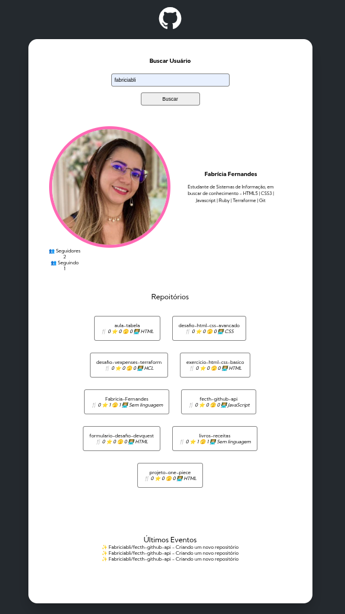
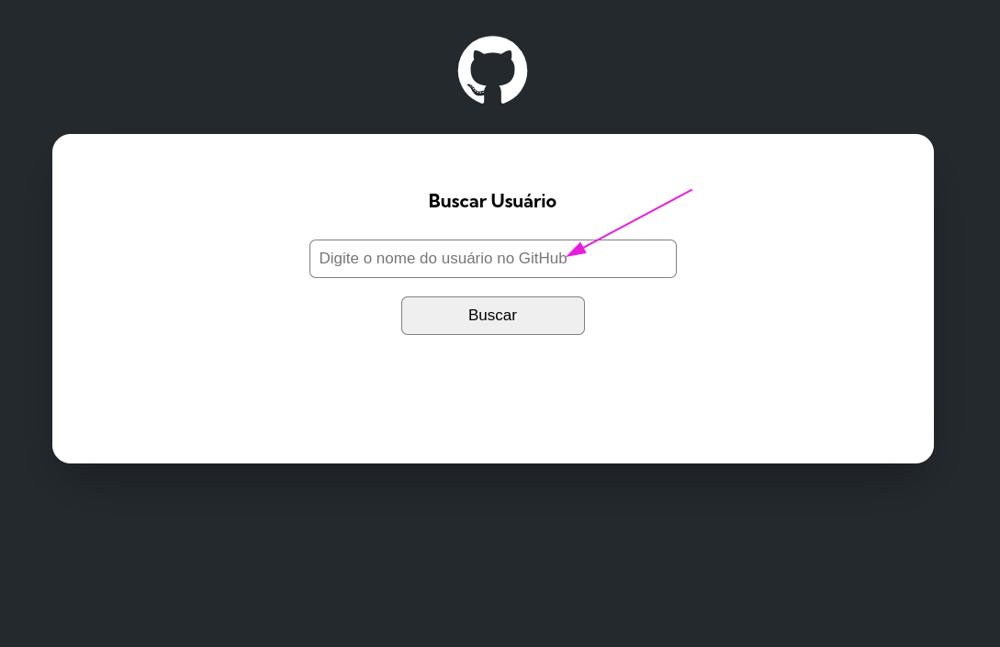

# projeto-final-fetch-github-api
Repositório contendo os arquivos finais do projeto de Fetch e GitHub API.

Projeto de estudo feito por Fabrícia Fernandes, com 💙

## 🖇️ Índice
- <a href="#projeto">O que é este Projeto?</a>
- <a href="#funcionalidades">Funcionalidades</a>
- <a href="#arquitetura">Arquitetura</a>
- <a href="#usar">Como Usar</a>
- <a href="#tecnologias">Tecnologias Utilizadas</a>
- <a href="#exemplo">Exemplo de Uso</a>
- <a href="#autorais">Pessoa Autoral</a>
- <a href="#passos">Passos Realizados</a>

## 📋 O que é este Projeto?

Este é um projeto que permite visualizar informações de perfis de usuários do GitHub, como dados do perfil, repositórios e eventos recentes, diretamente em uma interface web.

## 📌 Funcionalidades
- **Busca por usuário GitHub**: Ao inserir o nome de usuário do GitHub, a aplicação busca as informações relacionadas ao perfil.
- **Exibição de perfil**: Mostra a foto de perfil, nome, biografia, seguidores, e quantidade de repositórios.
- **Repositórios**: Exibe os 10 repositórios mais recentes do usuário com informações sobre forks, estrelas, linguagem de programação e mais.
- **Eventos recentes**: Mostra os eventos mais recentes do usuário, como pushes ou criação de novos repositórios.

## 🔧 Arquitetura
- **Estrutura Modular**: O código é dividido em diferentes módulos para facilitar a manutenção e reutilização:
- **Script.js**: Controla a interação do usuário, captura entradas e chama as funções para buscar e renderizar os dados.
- **User.js**: Faz a requisição de dados de um perfil de usuário no GitHub.
- **Repositories.js**: Obtém os repositórios de um usuário.
- **Events.js**: Captura eventos recentes relacionados ao usuário.
- **UserObject.js**: Modelo de dados que organiza e armazena as informações do usuário.
**Screen.js**: Responsável pela renderização dos dados na tela.
**Variables.js**: Define variáveis e URLs base para interações com a API do GitHub.

## 🔧 Como Usar
1. Abra o arquivo index.html em um navegador.
2. Insira o nome de usuário do GitHub no campo de pesquisa e clique no botão "Buscar".
3. As informações do perfil, repositórios e eventos recentes serão exibidas na tela.

## ⚙️ Tecnologias Utilizadas
1. [VS Code](https://code.visualstudio.com/): para programar.
2. [API do GitHub](https://docs.github.com/pt/rest/users/users?apiVersion=2022-11-28#get-a-user): Para obter os dados dos perfis de usuários, repositórios e eventos.
3. [JavaScript](https://developer.mozilla.org/pt-BR/docs/Web/JavaScript): Para lógica de interação e manipulação de dados.
4. [HTML](https://www.w3schools.com/html/) /[ CSS](https://www.w3schools.com/css/): Para a estrutura e estilo da interface.

## 📄 Exemplo de Uso
1. Preencha o nome do usuário GitHub no campo de pesquisa.
 
2. A interface exibirá as informações do usuário e os dados recentes.
 
## ✒️  Pessoa Autoral

 

Fabrícia Fernandes

[Linkedin](https://www.linkedin.com/in/fabriciafernandes/)

## 📄 Passos Realizados

Neste Projeto final, **foi acrescentado a visualização de:** 
 
- ✅ Número de seguidores do usuário;
- ✅ Número de pessoas que o usuário está seguindo;
- ✅ Os 10 últimos eventos do usuário e seus eventos recentes;
- ✅ Quantidade de forks do repositório;
- ✅ Quantidade de estrelas do repositório;
- ✅ Quantidade de watchers do repositório;
- ✅ E mostrar a linguagem de programação do repositório;

